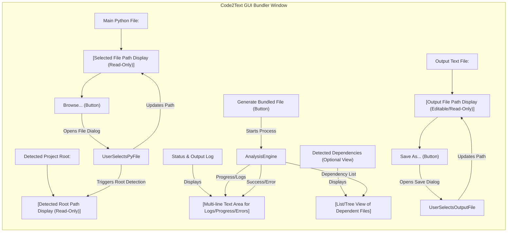

# Code2Text GUI Bundler

<!-- Zero Source Specification v1.0 -->
<!-- ZS:PLATFORM:DESKTOP -->
<!-- ZS:LANGUAGE:PYTHON -->
<!-- ZS:COMPLEXITY:MEDIUM -->

## Description

Code2Text GUI Bundler is a desktop application designed to help developers consolidate Python projects into a single text file. It analyzes a specified main Python script, identifies all local project dependencies (imported modules within the same project structure), and combines their source code into one output file. The files are ordered topologically, ensuring dependencies are listed before the files that import them. This tool is particularly useful for preparing codebases for analysis, sharing snapshots, or feeding into Large Language Models (LLMs) that require context in a single input. This application provides a simple graphical user interface (GUI) for ease of use, eliminating the need for command-line interaction.

## Functionality

### Core Features

-   **Select Main Python File:** Allows the user to browse and select the entry point Python file (`.py`) of their project via a standard file dialog.
-   **Select Output File Location:** Allows the user to specify the name and location for the generated combined text file (`.txt`).
-   **Automatic Project Root Detection:** Attempts to automatically determine the project's root directory based on the selected main file (e.g., looks for common markers like `pyproject.toml`, `.git`, or traverses up the directory tree). Provides feedback on the detected root.
-   **Dependency Analysis:** Parses the main Python file and recursively analyzes imported local modules using Abstract Syntax Trees (AST).
    -   Identifies `import` and `from ... import` statements.
    -   Distinguishes between standard library modules (ignored) and local project modules (included).
    -   Handles both absolute and relative imports within the project scope.
-   **Topological Sorting:** Organizes the identified project files (main file + dependencies) in a dependency-aware order. Files that other files depend on appear earlier in the output.
-   **Bundled Text File Generation:** Creates a single text file containing the source code of all identified project files, clearly demarcated.
-   **GUI Feedback:** Provides status updates, progress information, lists detected dependencies, and reports success or errors directly within the application window.
-   **Circular Dependency Detection:** Identifies and reports circular dependencies found during analysis (outputs a warning but attempts to proceed).

### User Interface

The application presents a clean and straightforward graphical user interface:



**UI Elements:**

1.  **Main Python File Section:**
    *   Label: "Main Python File:"
    *   Text Display: Shows the path to the selected `.py` file (read-only).
    *   Button: "Browse..." - Opens a system file dialog filtered for Python files.
2.  **Output Text File Section:**
    *   Label: "Output Text File:"
    *   Text Display/Input: Shows the path for the output `.txt` file. Could be editable or updated only via the button.
    *   Button: "Save As..." - Opens a system file save dialog filtered for text files.
3.  **Project Root Display:**
    *   Label: "Detected Project Root:"
    *   Text Display: Shows the automatically detected project root path (read-only).
4.  **Action Button:**
    *   Button: "Generate Bundled File" - Initiates the analysis and bundling process. Should be disabled until both input and output files are selected.
5.  **Status/Log Area:**
    *   A multi-line, scrollable text area displaying:
        *   Progress messages ("Analyzing imports...", "Building dependency graph...", "Sorting files...", "Writing output...").
        *   Detected dependencies list (optional, could be a separate view).
        *   Success message with the path to the output file.
        *   Error messages (e.g., "File not found", "Syntax error in file X", "Could not resolve import Y", "Circular dependency detected involving Z").
6.  **(Optional) Dependency View:** A separate list or tree view showing the file paths of all local dependencies identified.

### Behavior Specifications

1.  **Initial State:** Input/Output fields are empty. "Generate" button is disabled.
2.  **Selecting Main File:** User clicks "Browse...", selects a `.py` file. The file path appears in the display. The application attempts to detect the project root and displays it.
3.  **Selecting Output File:** User clicks "Save As...", chooses a location and name for the `.txt` file. The path appears in the display.
4.  **Enabling Generation:** Once both main input and output file paths are set, the "Generate" button becomes enabled.
5.  **Generation Process:**
    *   User clicks "Generate". The button might disable during processing.
    *   Status area clears previous logs.
    *   Status messages appear sequentially: "Starting analysis...", "Parsing main.py...", "Found import module_a...", "Parsing module_a.py...", "Building dependency graph...", "Topologically sorting files...", "Writing combined file to output.txt...".
    *   If successful, a "Bundling complete: output.txt created successfully." message appears.
    *   If errors occur (e.g., file parsing error, import not found), specific error messages are displayed in the status area. The process may halt depending on the error severity.
    *   Warnings (like circular dependencies) are logged, but the process continues if possible.
6.  **Output File Content:** The generated text file contains the source code of the dependencies followed by the main file, each wrapped in delimiters indicating the original file path relative to the project root. Example:
    ```text
    ```
    # Start of utils/helpers.py
    def helper_function():
        pass
    # End of utils/helpers.py
    ```

    ```
    # Start of main.py
    from utils.helpers import helper_function
    print("Hello")
    helper_function()
    # End of main.py
    ```

## Technical Implementation

### Architecture

-   **GUI Layer:** Handles user interaction, displays information, and triggers backend operations. Should use a standard cross-platform Python GUI toolkit (e.g., Tkinter, PyQt, Kivy, CustomTkinter).
-   **Core Logic Engine:** Contains the Python code analysis and bundling logic, separated from the GUI. This engine performs:
    -   AST Parsing
    -   Import Analysis (using `ast.NodeVisitor`)
    -   Dependency Graph Construction
    -   Topological Sorting
    -   File Reading & Writing
-   **Communication:** The GUI layer calls functions in the Core Logic Engine. The engine should provide progress updates and results back to the GUI layer (e.g., via callbacks, queues, or dedicated logging mechanisms).

### Core Logic Engine Details

-   **Import Analysis (`ImportAnalyzer`):**
    -   Subclass `ast.NodeVisitor`.
    -   Implement `visit_Import` and `visit_ImportFrom`.
    -   Maintain a set of identified local module names/paths.
    -   Filter out standard library modules (check against `sys.builtin_module_names` and potentially a list of standard library modules for the target Python version).
    -   Correctly resolve relative imports (`.` and `..`) based on the current file's path and the detected project root.
-   **Module Path Resolution (`resolve_module_path`):**
    -   Takes a module name (e.g., `my_package.utils`, `.helpers`), the importing file's path, and the project root path.
    -   Returns the absolute path to the corresponding `.py` file or `__init__.py` file.
    -   Handles both file modules (`module.py`) and package modules (`package/__init__.py`).
    -   Ensures resolved paths are within the detected project root.
-   **Dependency Graph (`build_dependency_graph`):**
    -   Uses a dictionary where keys are file paths and values are lists of file paths they import (dependencies).
    -   Uses a queue-based approach (like Breadth-First or Depth-First Search) starting from the main file to find all reachable local project files.
    -   Keeps track of visited files to avoid redundant parsing and handle cycles gracefully.
-   **Topological Sort (`topological_sort`):**
    -   Takes the dependency graph.
    -   Returns a list of file paths ordered such that for every directed edge from file `u` to file `v` (`u` imports `v`), `v` comes before `u` in the list.
    -   Must include cycle detection; if a cycle is detected, log a warning and return a best-effort ordering (or halt with error, TBD - warning preferred).
-   **File Combination (`create_combined_file`):**
    -   Iterates through the topologically sorted list of file paths.
    -   For each file, reads its content.
    -   Writes the content to the output file, wrapped in clearly marked start/end comment blocks that include the file's relative path from the project root.
    -   Handles potential file reading errors gracefully (log error, skip file, or halt).

### Data Structures

-   **Dependency Graph:** `Dict[str, List[str]]` (Mapping absolute file path to a list of absolute paths of its direct local dependencies).
-   **Analysis Queue:** `collections.deque[str]` (Queue of absolute file paths to analyze).
-   **Visited Set:** `Set[str]` (Set of absolute file paths already visited/processed).
-   **Sorted File List:** `List[str]` (Topologically sorted list of absolute file paths).

### Error Handling

-   **File Not Found:** Report error in GUI status log when the main file or a dependency cannot be found.
-   **Syntax Errors:** Catch `SyntaxError` during `ast.parse`. Report the file and error details in the GUI status log. May halt or attempt to continue.
-   **Import Resolution Errors:** Report warnings if an import cannot be resolved to a local project file.
-   **Circular Dependencies:** Detect during topological sort. Report a warning in the GUI status log, listing the involved files.
-   **File I/O Errors:** Catch exceptions during file reading/writing and report in the GUI.

## Style Guide

-   **GUI Appearance:** Clean, simple, and functional. Use native widgets where possible for platform consistency. Prioritize clarity over complex styling. Standard padding and spacing.
-   **Feedback:** Provide clear, informative messages in the status log. Use distinct visual cues for errors or warnings if possible (e.g., different text color).

## Testing Scenarios

The generated implementation should handle:

1.  A simple project with one main file and one dependency file.
2.  A project with multiple levels of dependencies (A imports B, B imports C).
3.  A project using relative imports (`from . import sibling`, `from ..package import module`).
4.  A project using absolute imports relative to the project root.
5.  A project structure involving packages (directories with `__init__.py`).
6.  Inputting a file that is not a Python file (should show an error).
7.  Inputting a Python file with syntax errors (should report the error).
8.  A project containing a circular dependency (should report a warning and still produce output if possible).
9.  Cases where the output file cannot be written (e.g., permissions issues).
10. Selecting input/output files with spaces or special characters in their paths.

## Accessibility Requirements

-   Ensure all UI controls are keyboard navigable (Tab order).
-   Use standard OS controls that typically inherit accessibility features (screen reader compatibility).
-   Ensure sufficient color contrast in the UI elements.
-   Labels should be associated with their respective controls.

## Performance Goals

-   The GUI should remain responsive during the analysis process (achieved by running the core logic in a separate thread or process).
-   Analysis of a medium-sized project (e.g., 20-30 files, ~5000 lines total) should complete within a few seconds on typical desktop hardware.